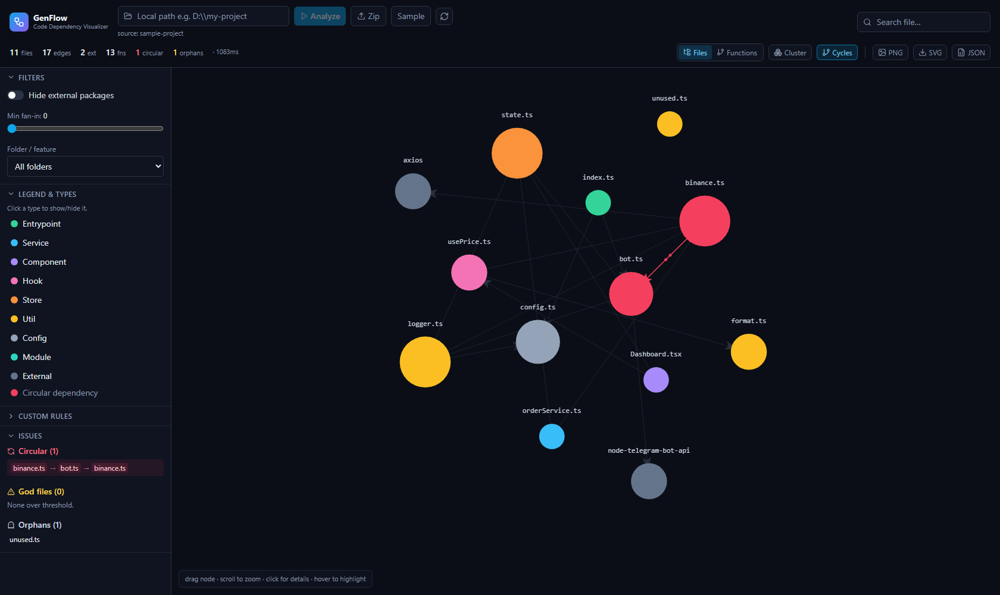

# GenFlow — Code Dependency Visualizer

> Đọc một project JS/TS, phân tích phụ thuộc **file · module · hàm** bằng AST thật
> (`ts-morph`), rồi vẽ thành **đồ thị tương tác force-directed** — nhìn một cái là hiểu kiến trúc.
>
> Read a JS/TS project, analyze its **file · module · function** dependencies with a real AST
> parser (`ts-morph`), and render an **interactive force-directed graph** — understand a codebase at a glance.



**🔒 Chạy 100% trên máy bạn — không đánh cắp source / Runs 100% locally — never steals your source.**

🌐 **[Tiếng Việt](#-tiếng-việt) · [English](#-english)**

---

# 🇻🇳 Tiếng Việt

## Công dụng

GenFlow giúp bạn **hiểu và quản lý kiến trúc** của một dự án JavaScript/TypeScript. Nó đọc
source code, dựng quan hệ phụ thuộc giữa các file/module và lời gọi giữa các hàm, rồi trực
quan hóa thành một **mind-map dạng đồ thị lực kéo** có thể kéo-thả, zoom, click xem chi tiết.
Bạn nhanh chóng biết: file nào là "trái tim", chỗ nào phụ thuộc vòng (circular), file nào
chết (orphan), file nào ôm đồm quá nhiều (god file).

## 🔒 Quyền riêng tư & Bảo mật (điểm cốt lõi)

GenFlow là **công cụ cá nhân/nội bộ**, được thiết kế để **không bao giờ làm lộ source của bạn**:

- **Phân tích hoàn toàn local.** Server phân tích chỉ lắng nghe ở `127.0.0.1` (máy bạn).
  Source code **không rời khỏi máy**, **không** upload lên cloud, **không** telemetry, **không** bên thứ ba.
- **API đọc file được kiểm soát chặt.** Endpoint preview chỉ đọc trong đúng thư mục bạn đã
  phân tích, **chống path-traversal** — mọi truy cập ra ngoài root đều trả `403`.
- **Dữ liệu là của bạn.** Bạn tự trỏ vào code của chính mình; kết quả (`graph.json`, ảnh export)
  nằm trên máy bạn. Rule tùy biến lưu trong `localStorage` của trình duyệt.

## ✨ Tính năng nổi bật

| Nhóm | Tính năng |
| --- | --- |
| **Phân tích** | AST thật (không regex): import tương đối, **alias `paths` của tsconfig**, index files, `require`, dynamic `import()`, re-export |
| **2 tầng đồ thị** | Graph phụ thuộc giữa **file** + **call graph cấp hàm** (hàm nào gọi hàm nào) |
| **Phân loại** | Tự gán type: entrypoint / service / component / hook / store / util / config / external / module — màu sắc + legend |
| **Phát hiện vấn đề** | **Circular dependency** (tô đỏ + particle), **orphan** (file mồ côi), **god file** (fan-in/out cao) |
| **Tương tác** | Kéo-thả node (ghim vị trí), zoom/pan, node to/nhỏ theo **fan-in** |
| **Khám phá** | Click → side panel (đường dẫn, imports / imported-by, **preview code**, mở trong VS Code); hover → sáng node + hàng xóm, làm mờ phần còn lại; **search** focus-zoom |
| **Lọc & nhóm** | Theo type (click legend) / thư mục / ngưỡng fan-in; ẩn external; **gom cụm theo folder** cho repo lớn |
| **Logic theo ý bạn** | Tự định nghĩa **rule regex** trên đường dẫn → đổi type / nhóm / màu (lưu trong trình duyệt) |
| **Nạp dữ liệu** | Trỏ **thư mục local** hoặc **upload `.zip`** |
| **Xuất** | **PNG / SVG / JSON** |
| **Vận hành** | **1 lệnh** `npm run dev`, hoặc **CLI offline** xuất `graph.json` |

## Cấu trúc dự án

```
GenFlow/
├─ analyzer/                 Node + TypeScript — bộ phân tích (engine), CLI và server API (Fastify)
│  ├─ src/
│  │  ├─ core/
│  │  │  ├─ scan.ts          duyệt thư mục, loại trừ node_modules/dist/build/coverage/test…
│  │  │  ├─ project.ts       tạo ts-morph Project, nạp compilerOptions từ tsconfig
│  │  │  ├─ resolve.ts       resolve module specifier → nội bộ / external / bỏ qua
│  │  │  ├─ fileGraph.ts     trích import/require/reexport/dynamic-import → cạnh giữa file
│  │  │  ├─ callGraph.ts     trích hàm + lời gọi (qua type checker) → call graph cấp hàm
│  │  │  ├─ classify.ts      heuristic gán type cho file
│  │  │  ├─ metrics.ts       tính fanIn / fanOut / externalDeps
│  │  │  ├─ issues.ts        Tarjan SCC (circular), orphan, god file
│  │  │  └─ buildGraph.ts    điều phối toàn bộ pipeline → GraphJSON
│  │  ├─ types.ts            schema JSON chuẩn (nguồn chân lý)
│  │  ├─ index.ts            CLI (commander)
│  │  └─ server.ts           Fastify: /api/graph, /api/upload, /api/file, /api/health
│  └─ test/                  vitest + fixtures (circular, alias, external, calls, orphan)
├─ web/                      React + TypeScript + Vite + Tailwind — giao diện đồ thị
│  └─ src/
│     ├─ store/useGraphStore.ts   state toàn cục (zustand): graph, filter, rule, view…
│     ├─ lib/
│     │  ├─ deriveGraph.ts        dựng đồ thị hiển thị từ graph thô + filter + rule + view
│     │  ├─ rules.ts              biên dịch & áp rule regex tùy biến
│     │  └─ exportImage.ts        export PNG / SVG / JSON
│     ├─ components/              GraphCanvas, SidePanel, Toolbar, FilterPanel, RulesPanel,
│     │                           IssuesPanel, Legend, SearchBar, StatsBar, SourceLoader
│     ├─ theme.ts                 màu theo type + legend
│     ├─ api.ts                   gọi API
│     └─ types.ts                 mirror của schema analyzer
├─ sample-project/           repo demo nhỏ (cố tình có 1 circular bot ↔ binance)
└─ docs/                      spec thiết kế + ảnh chụp
```

> **Tách bạch rõ ràng:** analyzer (backend, ngôn ngữ-cụ thể) chỉ sinh ra một **file JSON chuẩn**;
> web (frontend) chỉ tiêu thụ JSON đó nên **không phụ thuộc ngôn ngữ**. Muốn thêm Python/Go chỉ cần
> viết analyzer mới xuất đúng schema.

## Cách hoạt động (pipeline & logic)

Đường đi: `scan → ts-morph project → fileGraph → callGraph → classify → metrics → issues → JSON`

1. **scan** — duyệt project, bỏ qua `node_modules, dist, build, .git, coverage`, file lock, và
   (mặc định) file test (`*.test.*`, `*.spec.*`, `__tests__`).
2. **ts-morph project** — nạp file với compilerOptions lấy từ `tsconfig.json` của chính project
   (nhờ vậy alias `paths`, `baseUrl`, JSX… đều đúng).
3. **file graph** — gom mọi `import / require / re-export / dynamic import`, rồi dùng trình resolve
   của TypeScript để tìm đích (tôn trọng **alias `paths`** và **index file**). Specifier không
   resolve về file nội bộ → tạo node **external** (gói npm). Không bịa cạnh.
4. **call graph** — gom function / method / arrow declaration thành node hàm; với mỗi lời gọi,
   resolve qua **type checker** (đi theo chuỗi import alias) để nối `file#hàm → file#hàm`. Lời gọi
   động/tính toán (`obj[x]()`) **bị bỏ qua và đếm lại**, không tạo cạnh giả.
5. **classify & metrics** — gán type theo heuristic; tính `fanIn` (số file import nó), `fanOut`
   (số file nội bộ nó import), `externalDeps`, `loc` (dòng không trống).
6. **issues** — **Tarjan SCC** tìm thành phần liên thông mạnh (kích thước > 1 = chu trình → trích
   một chu trình có thứ tự); **orphan** = không có cạnh nào; **god file** = fan-in ≥ 10 hoặc fan-out ≥ 15 (chỉnh được).

### Logic phân loại node (heuristic)

| Type | Điều kiện (rút gọn) |
| --- | --- |
| `entrypoint` | `main/module/bin` trong package.json, hoặc tên `index/main/app/server/bot/cli` ở mức nông & không bị ai import |
| `config` | `*.config.*`, thư mục `config`, `.env*`, `tsconfig` |
| `store` | thư mục `store/state/redux`, `*.slice/*.store/*.reducer/*.atom` |
| `service` | thư mục `services/api/clients/gateways`, `*.service/*.api/*.client` |
| `hook` | thư mục `hooks`, hoặc tên `use*` |
| `component` | `*.tsx/*.jsx`, hoặc thư mục `components/views/pages/screens/widgets` |
| `util` | thư mục `utils/lib/helpers/common/shared`, `*.util/*.helper` |
| `module` | mặc định khi không khớp |
| `external` | gói npm không resolve về file nội bộ |

> Ở giao diện, **rule regex tùy biến** của bạn được áp **đè lên** heuristic này (đổi type/nhóm/màu theo ý).

### Hiển thị (frontend) hoạt động ra sao

`useGraphStore` (zustand) giữ graph thô + trạng thái (view file/function, filter, rule, chọn/hover,
cluster…). [deriveGraph.ts](web/src/lib/deriveGraph.ts) tính ra **đồ thị hiển thị** (lọc node, áp rule,
đánh dấu cạnh circular, dựng adjacency để highlight). [GraphCanvas.tsx](web/src/components/GraphCanvas.tsx)
vẽ bằng `react-force-graph-2d` (canvas): tự vẽ node (màu/cỡ/nhãn), particle cho cạnh circular, làm mờ
node không liên quan khi hover/chọn, gom cụm bằng một lực d3 kéo node về tâm folder, và zoom-to-fit khi đổi dữ liệu.

## Yêu cầu

- Node.js ≥ 18 (phát triển trên Node 22) · npm ≥ 9

## Cài đặt

```bash
npm install   # cài cả 2 workspace: analyzer + web
```

## Chạy (1 lệnh)

```bash
npm run dev
```

Khởi động:
- **Analyzer API** ở `http://127.0.0.1:5174`
- **Web app** ở `http://localhost:5173` (tự mở trình duyệt)

Lần đầu sẽ tự phân tích `sample-project/` và hiện đồ thị — gồm circular `bot.ts ↔ binance.ts` tô đỏ.

> Chạy mà không tự mở trình duyệt: `GENFLOW_OPEN=false npm run dev`.

### Phân tích project của bạn

Trên thanh trên cùng: nhập **đường dẫn local** (vd `D:\my-project`) rồi bấm **Analyze**, hoặc bấm
**Zip** để tải lên `.zip`, hoặc **Sample** để nạp lại demo.

## CLI (offline)

```bash
npm run analyze -- <path> -o graph.json --pretty
npm run analyze -- ./sample-project -o graph.json --pretty
npm run analyze -- ../some-app -o graph.json --no-functions   # bỏ call graph (nhanh hơn)
```

| flag | mô tả | mặc định |
| --- | --- | --- |
| `-o, --output <file>` | ghi JSON ra file (mặc định in ra stdout) | — |
| `--no-functions` | bỏ call graph cấp hàm | bật |
| `--include-tests` | gồm cả file test | loại |
| `--god-fan-in <n>` | ngưỡng fan-in cho "god file" | 10 |
| `--god-fan-out <n>` | ngưỡng fan-out cho "god file" | 15 |
| `--pretty` | in JSON đẹp | tắt |

## HTTP API

| endpoint | mô tả |
| --- | --- |
| `GET /api/graph?path=<dir>&functions=true&includeTests=false` | phân tích thư mục local (bỏ `path` → dùng sample). Cache theo path + mtime; `refresh=1` để ép phân tích lại. |
| `POST /api/upload` (multipart `file=<zip>`) | phân tích file zip tải lên |
| `GET /api/file?root=<dir>&path=<file>` | đọc source cho preview (**chống path-traversal**, chỉ trong root) |
| `GET /api/health` | kiểm tra sống |

## Schema JSON đầu ra

```jsonc
{
  "version": "1.0",
  "root": "/abs/path",
  "meta": { "fileCount": 11, "edgeCount": 17, "functionCount": 13, "languages": ["ts","tsx"] },
  "nodes": [
    { "id": "src/bot.ts", "label": "bot.ts", "type": "service", "group": "src",
      "loc": 17, "fanIn": 2, "fanOut": 3, "externalDeps": 1, "level": "file", "isExternal": false }
  ],
  "edges": [ { "source": "src/bot.ts", "target": "src/services/binance.ts", "kind": "import" } ],
  "functions": {
    "nodes": [ { "id": "src/bot.ts#startBot", "file": "src/bot.ts", "label": "startBot", "line": 12, "loc": 6, "exported": true, "level": "function" } ],
    "edges": [ { "source": "src/bot.ts#startBot", "target": "src/utils/logger.ts#log", "kind": "call" } ]
  },
  "issues": {
    "circular": [ ["src/services/binance.ts","src/bot.ts","src/services/binance.ts"] ],
    "orphans": ["src/utils/unused.ts"],
    "godFiles": [ { "id": "src/util.ts", "fanIn": 22, "fanOut": 0 } ]
  }
}
```

## Kiểm thử

```bash
npm test            # bộ vitest của analyzer (file graph, alias, external, circular, call graph)
npm run typecheck   # kiểm tra kiểu cho analyzer
```

## Giới hạn & mở rộng

- Call graph dùng type checker của TypeScript; với repo rất lớn lần phân tích đầu có thể mất vài
  giây (kết quả được cache ở server). Dùng `--no-functions` để bỏ qua cho nhanh.
- SVG export là vector dựng lại từ vị trí node hiện tại (không phải bản sao pixel của canvas);
  PNG export là ảnh canvas chính xác.
- Thêm ngôn ngữ khác (Python/Go) = viết analyzer mới xuất **đúng schema JSON** — web không cần đổi.

## App Desktop (Electron · Mac + Windows)

GenFlow có bản desktop đóng gói bằng Electron: **UI nạp từ file local** (không qua URL/server), analyzer
chạy thẳng trong app, và **tự phân tích lại realtime** khi code thay đổi.

- **Chạy dev:** `npm run desktop` (build web + main rồi mở Electron).
- **Đóng gói:** `npm run desktop:dist` → ra `desktop/release/` (Win: `GenFlow-<ver>-win-x64.zip`
  → giải nén rồi chạy `GenFlow.exe`; Mac: `.dmg`/`.zip`; Linux: AppImage).
  > ℹ️ Trên Windows, electron-builder cần giải nén tool `winCodeSign` có chứa symlink — vốn đòi
  > quyền Admin/Developer Mode. GenFlow tự xử lý qua [prepare-wincodesign.mjs](desktop/scripts/prepare-wincodesign.mjs)
  > (chạy trước khi build, bỏ phần `darwin`) nên **build được mà không cần admin**.
  > ⚠️ Đóng app GenFlow đang chạy **trước khi build lại** (tránh khóa file `*.dll`).
  > ⚠️ `.dmg` cho Mac **chỉ build trên macOS**. Dùng GitHub Actions
  > ([.github/workflows/desktop-release.yml](.github/workflows/desktop-release.yml)) để build cả
  > Mac + Win cùng lúc (push tag `v0.0.1` hoặc chạy workflow thủ công).

**Cách dùng:** mở app → **Open folder** (hộp thoại native) → graph hiện ngay. Bật **Watch** để theo dõi:
mỗi lần lưu file, app gộp ~400ms rồi phân tích lại và cập nhật map — node mới hiện ra, node xoá biến
mất, **giữ nguyên vị trí** node cũ.

**Kiến trúc:** renderer (React) ↔ main process qua **IPC** (`contextBridge`), không network. Analyzer
chạy trong **worker thread** để UI luôn mượt; `chokidar` theo dõi thay đổi; ts-morph Project giữ ấm
giữa các lần phân tích nên re-analyze nhanh.

## Deploy (Node service)

GenFlow là **full-stack**: một Node service phục vụ cả `/api` lẫn web UI (cùng origin). Ở
production, server tự bind `0.0.0.0` và phục vụ `web/dist`.

- **Build command:** `npm install --include=dev && npm run build` (`--include=dev` ensures vite/tsx/typescript are installed even when `NODE_ENV=production`)
- **Start command:** `npm start` (chạy analyzer server, phục vụ API + SPA)
- Platform tự set `PORT` → server đọc `process.env.PORT`.

Config sẵn kèm theo:
- **Render** → dùng [`render.yaml`](render.yaml) (Blueprint, đã khai sẵn build/start + healthcheck).
- **Railway / Heroku-style** → [`Procfile`](Procfile) (`web: npm start`) + build script.
- **Fly.io / VPS / container** → [`Dockerfile`](Dockerfile): `docker build -t genflow . && docker run -p 5174:5174 genflow`.

> ⚠️ Hãy khai **build command tường minh** như trên để platform dùng đúng build (đã scoped) —
> tránh việc nó tự chạy `tsc` toàn repo rồi fail ở `sample-project/` (đó là nguyên nhân lỗi deploy).
> ⚠️ Bản deploy **public** có thể đọc filesystem của server qua `/api/graph?path=`. Chỉ deploy
> nội bộ / sau auth.

## Công nghệ

`ts-morph` · `fastify` · `commander` · `vitest` · React · Vite · TypeScript · Tailwind ·
`react-force-graph-2d` · `zustand` · `lucide-react`

---

# 🇬🇧 English

## What it does

GenFlow helps you **understand and manage the architecture** of a JavaScript/TypeScript project.
It reads the source, builds the dependency relationships between files/modules and the call
relationships between functions, then visualizes them as an **interactive force-directed mind-map**
you can drag, zoom, and click to inspect. You instantly see which file is the "heart" of the project,
where the **circular** dependencies are, which files are **dead** (orphans), and which ones do **too
much** (god files).

## 🔒 Privacy & Security (the core promise)

GenFlow is a **personal/internal tool**, designed so your source **never leaks**:

- **Fully local analysis.** The analyzer server only listens on `127.0.0.1` (your machine).
  Source code **never leaves your machine** — **no** cloud upload, **no** telemetry, **no** third party.
- **Tightly scoped file API.** The preview endpoint can only read inside the directory you analyzed,
  with **path-traversal protection** — any access outside the root returns `403`.
- **Your data stays yours.** You point it at your own code; outputs (`graph.json`, exported images)
  live on your machine. Custom rules are saved in your browser's `localStorage`.

## ✨ Highlight features

| Area | Feature |
| --- | --- |
| **Analysis** | Real AST (no regex): relative imports, **tsconfig `paths` aliases**, index files, `require`, dynamic `import()`, re-exports |
| **Two graph levels** | A **file** dependency graph + a **function-level call graph** (who calls whom) |
| **Classification** | Auto type: entrypoint / service / component / hook / store / util / config / external / module — colors + legend |
| **Issue detection** | **Circular dependencies** (red + particles), **orphans**, **god files** (high fan-in/out) |
| **Interaction** | Drag nodes (pinned), zoom/pan, node size by **fan-in** |
| **Exploration** | Click → side panel (path, imports / imported-by, **code preview**, open in VS Code); hover → highlight node + neighbors, dim the rest; **search** focus-zoom |
| **Filter & group** | By type (click legend) / folder / min fan-in; hide external; **cluster by folder** for big repos |
| **Your own logic** | Define **regex rules** on paths → override type / group / color (persisted in the browser) |
| **Input** | Point at a **local folder** or **upload a `.zip`** |
| **Export** | **PNG / SVG / JSON** |
| **Run** | **One command** `npm run dev`, or an **offline CLI** that emits `graph.json` |

## Project structure

```
GenFlow/
├─ analyzer/                 Node + TypeScript — analysis engine, CLI and API server (Fastify)
│  ├─ src/
│  │  ├─ core/
│  │  │  ├─ scan.ts          walk the tree, exclude node_modules/dist/build/coverage/tests…
│  │  │  ├─ project.ts       create the ts-morph Project, load tsconfig compilerOptions
│  │  │  ├─ resolve.ts       resolve a module specifier → internal / external / skip
│  │  │  ├─ fileGraph.ts     extract import/require/reexport/dynamic-import → file edges
│  │  │  ├─ callGraph.ts     extract functions + calls (via type checker) → function call graph
│  │  │  ├─ classify.ts      heuristics to type each file
│  │  │  ├─ metrics.ts       compute fanIn / fanOut / externalDeps
│  │  │  ├─ issues.ts        Tarjan SCC (circular), orphans, god files
│  │  │  └─ buildGraph.ts    orchestrate the whole pipeline → GraphJSON
│  │  ├─ types.ts            canonical JSON schema (source of truth)
│  │  ├─ index.ts            CLI (commander)
│  │  └─ server.ts           Fastify: /api/graph, /api/upload, /api/file, /api/health
│  └─ test/                  vitest + fixtures (circular, alias, external, calls, orphan)
├─ web/                      React + TypeScript + Vite + Tailwind — the graph UI
│  └─ src/
│     ├─ store/useGraphStore.ts   global state (zustand): graph, filters, rules, view…
│     ├─ lib/
│     │  ├─ deriveGraph.ts        build the render graph from raw graph + filters + rules + view
│     │  ├─ rules.ts              compile & apply custom regex rules
│     │  └─ exportImage.ts        export PNG / SVG / JSON
│     ├─ components/              GraphCanvas, SidePanel, Toolbar, FilterPanel, RulesPanel,
│     │                           IssuesPanel, Legend, SearchBar, StatsBar, SourceLoader
│     ├─ theme.ts                 colors per type + legend
│     ├─ api.ts                   API client
│     └─ types.ts                 mirror of the analyzer schema
├─ sample-project/           tiny demo repo (deliberate bot ↔ binance circular dependency)
└─ docs/                      design spec + screenshot
```

> **Clean separation:** the analyzer (backend, language-specific) only emits a **canonical JSON
> file**; the web app (frontend) only consumes that JSON, so it is **language-agnostic**. Adding
> Python/Go just means writing a new analyzer that emits the same schema.

## How it works (pipeline & logic)

Flow: `scan → ts-morph project → fileGraph → callGraph → classify → metrics → issues → JSON`

1. **scan** — walk the project, ignoring `node_modules, dist, build, .git, coverage`, lockfiles,
   and (by default) test files (`*.test.*`, `*.spec.*`, `__tests__`).
2. **ts-morph project** — load files using compilerOptions taken from the project's own
   `tsconfig.json`, so `paths` aliases, `baseUrl`, JSX, etc. all resolve correctly.
3. **file graph** — collect every `import / require / re-export / dynamic import`, then use
   TypeScript's resolver to find the target (honoring **`paths` aliases** and **index files**).
   Specifiers that don't resolve to an internal file become **external** (npm package) nodes.
   No edges are fabricated.
4. **call graph** — collect function / method / arrow declarations as function nodes; for each
   call expression, resolve it through the **type checker** (following import-alias chains) to link
   `file#fn → file#fn`. Dynamic/computed calls (`obj[x]()`) are **skipped and counted**, never faked.
5. **classify & metrics** — assign a type via heuristics; compute `fanIn` (files importing it),
   `fanOut` (internal files it imports), `externalDeps`, `loc` (non-blank lines).
6. **issues** — **Tarjan SCC** finds strongly-connected components (size > 1 = a cycle → extract one
   ordered cycle); **orphan** = no edges at all; **god file** = fan-in ≥ 10 or fan-out ≥ 15 (configurable).

### Node classification logic (heuristics)

| Type | Condition (short) |
| --- | --- |
| `entrypoint` | package.json `main/module/bin`, or named `index/main/app/server/bot/cli` shallow & imported by nobody |
| `config` | `*.config.*`, a `config` folder, `.env*`, `tsconfig` |
| `store` | `store/state/redux` folders, `*.slice/*.store/*.reducer/*.atom` |
| `service` | `services/api/clients/gateways` folders, `*.service/*.api/*.client` |
| `hook` | a `hooks` folder, or `use*` names |
| `component` | `*.tsx/*.jsx`, or `components/views/pages/screens/widgets` folders |
| `util` | `utils/lib/helpers/common/shared` folders, `*.util/*.helper` |
| `module` | default fallback |
| `external` | npm package not resolving to an internal file |

> In the UI, your **custom regex rules** are applied **on top of** these heuristics (override type/group/color).

### How the frontend works

`useGraphStore` (zustand) holds the raw graph + state (file/function view, filters, rules,
selection/hover, clustering…). [deriveGraph.ts](web/src/lib/deriveGraph.ts) computes the **render
graph** (filter nodes, apply rules, flag circular edges, build adjacency for highlighting).
[GraphCanvas.tsx](web/src/components/GraphCanvas.tsx) draws with `react-force-graph-2d` (canvas):
custom node painting (color/size/label), particles on circular edges, dimming of unrelated nodes
on hover/select, folder clustering via a custom d3 force pulling nodes toward folder centroids, and
zoom-to-fit when the dataset changes.

## Requirements

- Node.js ≥ 18 (developed on Node 22) · npm ≥ 9

## Install

```bash
npm install   # installs both workspaces: analyzer + web
```

## Run (one command)

```bash
npm run dev
```

Starts:
- the **analyzer API** on `http://127.0.0.1:5174`
- the **web app** on `http://localhost:5173` (opens automatically)

On first load it analyzes `sample-project/` and shows the graph — including the `bot.ts ↔ binance.ts`
circular dependency in red.

> Launch without auto-opening the browser: `GENFLOW_OPEN=false npm run dev`.

### Analyze your own project

In the top bar: type a **local path** (e.g. `D:\my-project`) and click **Analyze**, or click
**Zip** to upload a `.zip`, or **Sample** to reload the demo.

## CLI (offline)

```bash
npm run analyze -- <path> -o graph.json --pretty
npm run analyze -- ./sample-project -o graph.json --pretty
npm run analyze -- ../some-app -o graph.json --no-functions   # skip the call graph (faster)
```

| flag | description | default |
| --- | --- | --- |
| `-o, --output <file>` | write JSON to a file (else stdout) | — |
| `--no-functions` | skip the function-level call graph | functions on |
| `--include-tests` | include test/spec files | excluded |
| `--god-fan-in <n>` | fan-in threshold for god files | 10 |
| `--god-fan-out <n>` | fan-out threshold for god files | 15 |
| `--pretty` | pretty-print JSON | off |

## HTTP API

| endpoint | description |
| --- | --- |
| `GET /api/graph?path=<dir>&functions=true&includeTests=false` | analyze a local directory (omit `path` → bundled sample). Cached by path + file mtimes; pass `refresh=1` to force. |
| `POST /api/upload` (multipart `file=<zip>`) | analyze an uploaded zip archive |
| `GET /api/file?root=<dir>&path=<file>` | read a file's source for the code preview (**path-traversal guarded**, root-scoped) |
| `GET /api/health` | health check |

## Output schema (JSON)

```jsonc
{
  "version": "1.0",
  "root": "/abs/path",
  "meta": { "fileCount": 11, "edgeCount": 17, "functionCount": 13, "languages": ["ts","tsx"] },
  "nodes": [
    { "id": "src/bot.ts", "label": "bot.ts", "type": "service", "group": "src",
      "loc": 17, "fanIn": 2, "fanOut": 3, "externalDeps": 1, "level": "file", "isExternal": false }
  ],
  "edges": [ { "source": "src/bot.ts", "target": "src/services/binance.ts", "kind": "import" } ],
  "functions": {
    "nodes": [ { "id": "src/bot.ts#startBot", "file": "src/bot.ts", "label": "startBot", "line": 12, "loc": 6, "exported": true, "level": "function" } ],
    "edges": [ { "source": "src/bot.ts#startBot", "target": "src/utils/logger.ts#log", "kind": "call" } ]
  },
  "issues": {
    "circular": [ ["src/services/binance.ts","src/bot.ts","src/services/binance.ts"] ],
    "orphans": ["src/utils/unused.ts"],
    "godFiles": [ { "id": "src/util.ts", "fanIn": 22, "fanOut": 0 } ]
  }
}
```

## Tests

```bash
npm test            # analyzer vitest suite (file graph, aliases, externals, circular, call graph)
npm run typecheck   # type-check the analyzer
```

## Limitations & extending

- The call graph uses the TypeScript type checker; on very large repos the first analysis can take
  a few seconds (results are cached server-side). Use `--no-functions` to skip it.
- SVG export is a vector rebuilt from current node positions (not a pixel copy of the canvas);
  PNG export is the exact canvas.
- Adding another language (Python/Go) means writing a new analyzer that emits the same **JSON
  schema** — the web app needs no changes.

## Desktop app (Electron · Mac + Windows)

GenFlow ships as an Electron desktop app: the **UI loads from local files** (no URL/server), the
analyzer runs in-process, and it **re-analyzes in realtime** as your code changes.

- **Run (dev):** `npm run desktop` (builds web + main, then opens Electron).
- **Package:** `npm run desktop:dist` → `desktop/release/` (Win: `GenFlow-<ver>-win-x64.zip` —
  unzip and run `GenFlow.exe`; Mac: `.dmg`/`.zip`; Linux: AppImage).
  > ℹ️ On Windows, electron-builder must extract its `winCodeSign` tool, which contains symlinks
  > that normally require Admin/Developer Mode. GenFlow handles this automatically via
  > [prepare-wincodesign.mjs](desktop/scripts/prepare-wincodesign.mjs) (a prebuild step that extracts
  > everything except `darwin/`), so **the build works without admin**.
  > ⚠️ Close any running GenFlow app **before rebuilding** (avoids locked `*.dll`).
  > ⚠️ A Mac `.dmg` **can only be built on macOS**. Use the GitHub Actions workflow
  > ([.github/workflows/desktop-release.yml](.github/workflows/desktop-release.yml)) to build both
  > Mac + Win (push a `v0.0.1` tag, or run it manually).

**Usage:** open the app → **Open folder** (native dialog) → the graph appears. Toggle **Watch** to
track changes: on each save the app debounces ~400ms, re-analyzes, and updates the map — new nodes
appear, deleted ones vanish, and existing node **positions are preserved**.

**Architecture:** the renderer (React) talks to the main process over **IPC** (`contextBridge`), no
network. The analyzer runs in a **worker thread** to keep the UI smooth; `chokidar` watches changes;
the ts-morph Project stays warm between analyses so re-analysis is fast.

## Deploy (Node service)

GenFlow is **full-stack**: one Node service serves both `/api` and the web UI (same origin). In
production the server binds `0.0.0.0` and serves `web/dist`.

- **Build command:** `npm install --include=dev && npm run build` (`--include=dev` ensures vite/tsx/typescript are installed even when `NODE_ENV=production`)
- **Start command:** `npm start` (runs the analyzer server, serving API + SPA)
- The platform sets `PORT` → the server reads `process.env.PORT`.

Bundled configs:
- **Render** → use [`render.yaml`](render.yaml) (Blueprint; build/start + healthcheck preconfigured).
- **Railway / Heroku-style** → [`Procfile`](Procfile) (`web: npm start`) + the build script.
- **Fly.io / VPS / container** → [`Dockerfile`](Dockerfile): `docker build -t genflow . && docker run -p 5174:5174 genflow`.

> ⚠️ Set the **build command explicitly** as above so the platform uses the scoped build —
> otherwise it may run a repo-wide `tsc` and fail on `sample-project/` (the cause of the deploy error).
> ⚠️ A **public** deployment can read the server's filesystem via `/api/graph?path=`. Deploy
> internally / behind auth only.

## Tech

`ts-morph` · `fastify` · `commander` · `vitest` · React · Vite · TypeScript · Tailwind ·
`react-force-graph-2d` · `zustand` · `lucide-react`
